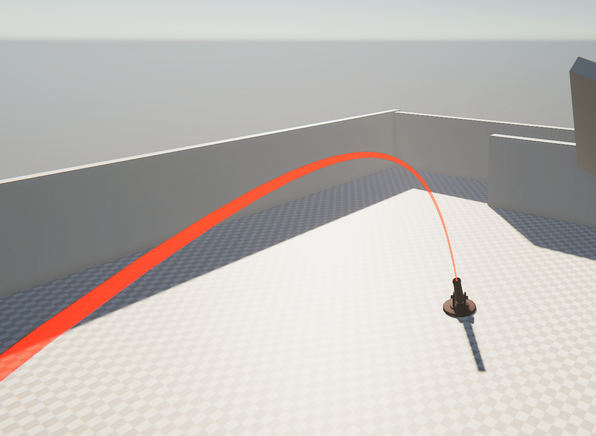
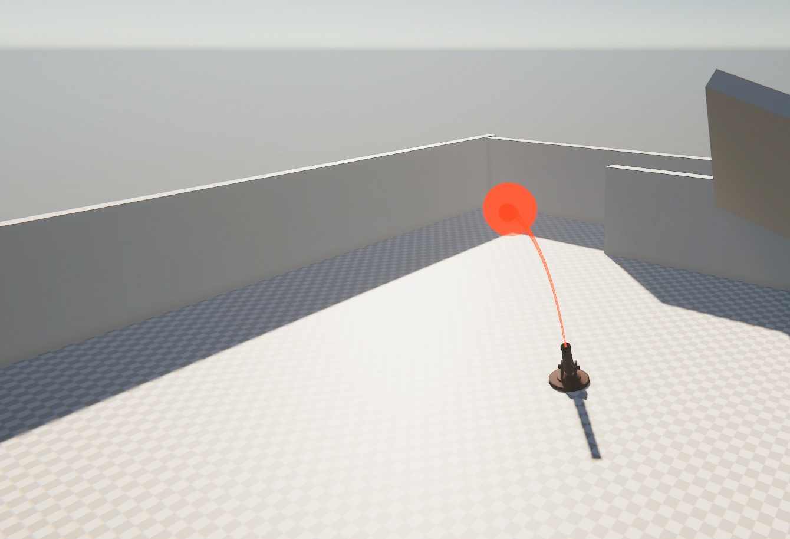
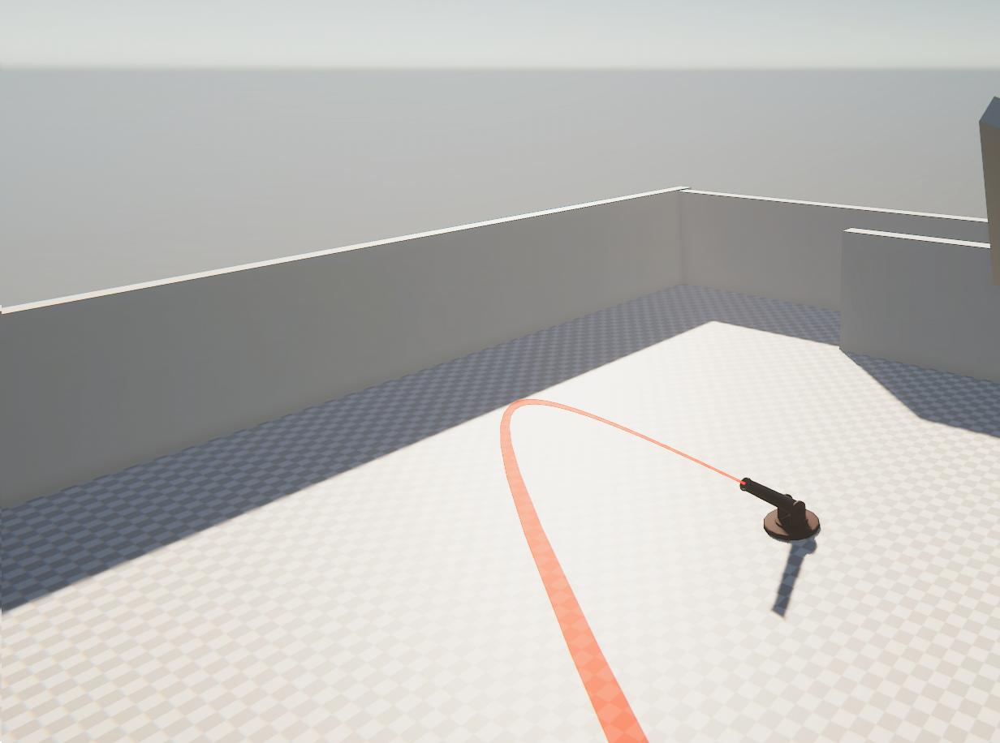

# ProjectileTrajectory
Draws a trajectory for a projectile using physics and raycasts to determine collisions. Can increase the amount of checks along a path to increase accuracy at the cost of performance.

Rigidbodies using the same initial velocity will follow the path.

Can follow trajectories that have nonstandard gravity.

